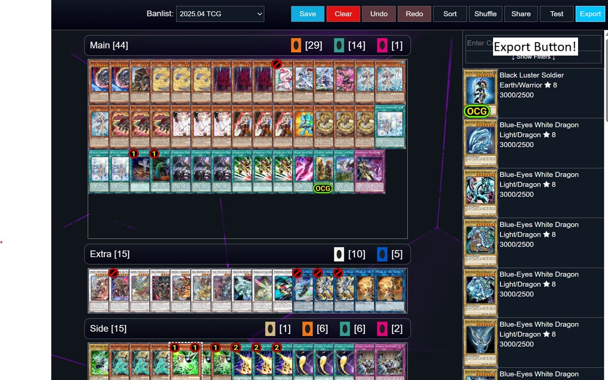
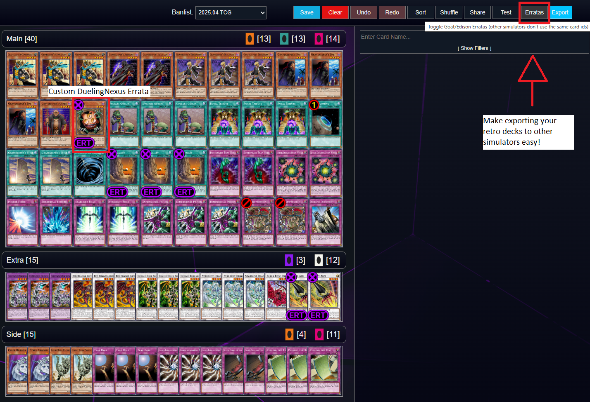
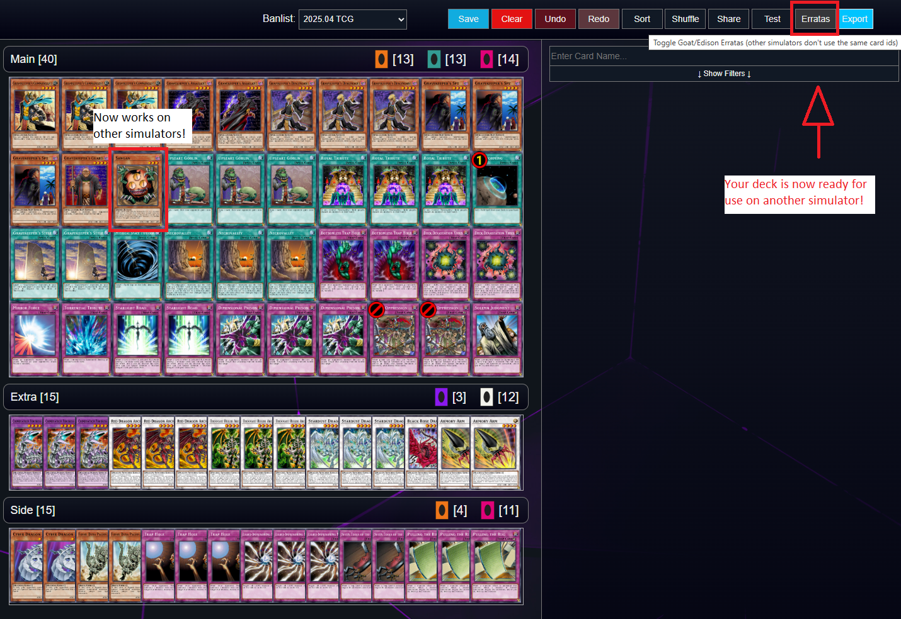

# duelingnexus-deck-exporter
Chrome extension which adds a deck export button to DuelingNexus's deck editor. Goat/Edison erratas may not work in other simulators. The old exporter seems to have been taken down, so this was made in its place.

This is pending approval on the app store, but in the meantime it can be added manually by going to Extensions -> Manage Extensions -> Enable Developer Mode (top-right) -> Load Unpacked -> select the downloaded & extracted extension folder 
Or you can paste the contents of content.js into your chrome/firefox console, and it will add the button to that page.

