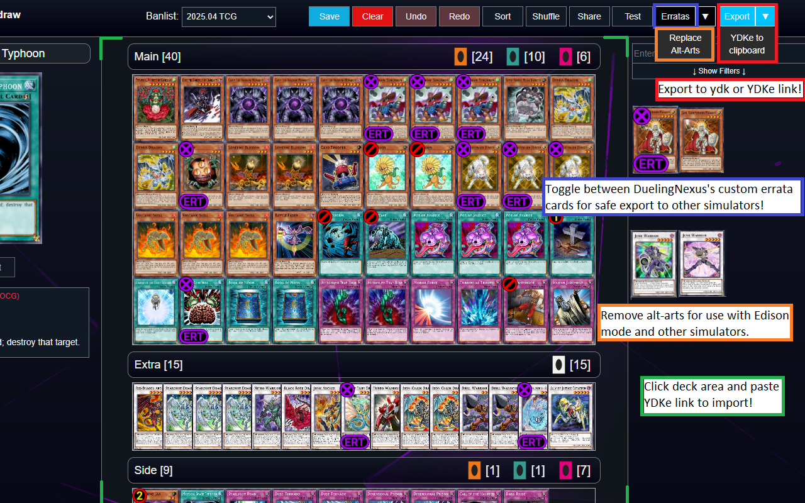
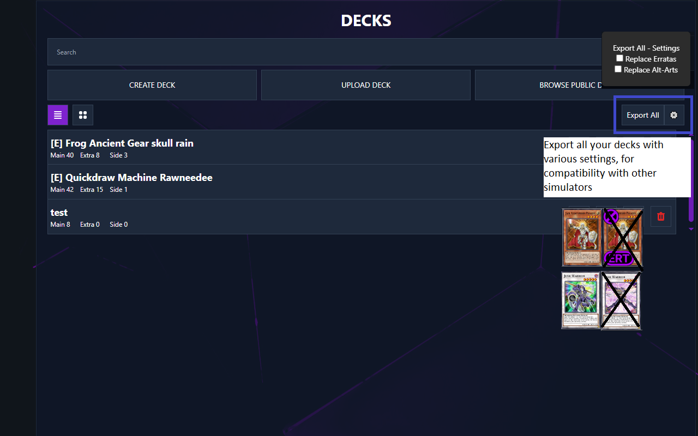

# Dueling Nexus Deck Exporter
Chrome/Firefox extension for DuelingNexus.com  
Export your deck as ydk, import/export as YDKe link, download all your decks as a zip file and more! The old exporter no longer works, so this was made in its place. 
Feel free to suggest new features.  
https://chromewebstore.google.com/detail/dueling-nexus-deck-export/pjgponfjenccmekfflegcaflngfbokde 
https://addons.mozilla.org/en-CA/firefox/addon/dueling-nexus-deck-exporter/  

## Features

### Export
* Export to ydk file
* Export as ydke link to your clipboard
* Export all decks to a zip with individual ydk files
  * Optionally replace custom erratas
  * Optionally replace alt-arts with their default counterpart

### Import
* Paste YDKe link after clicking deck area to overwrite the current deck

### Editor Improvements
* Errata toggle
* Remove alt-arts for Edison mode and compatibility with other simulators

## Feature Images

## Licensing

This project is licensed under the GNU GENERAL PUBLIC LICENSE (GPL). See the `LICENSE` file for more information.

This project also uses the `YDKe.js` library, which was converted from TypeScript and is licensed under the GNU LESSER GENERAL PUBLIC LICENSE (LGPL). See the [lib/YDKe.js.license](cci:7://file:///c:/repo/duelingnexus-deck-exporter/lib/YDKe.js.license:0:0-0:0) file for more information.

